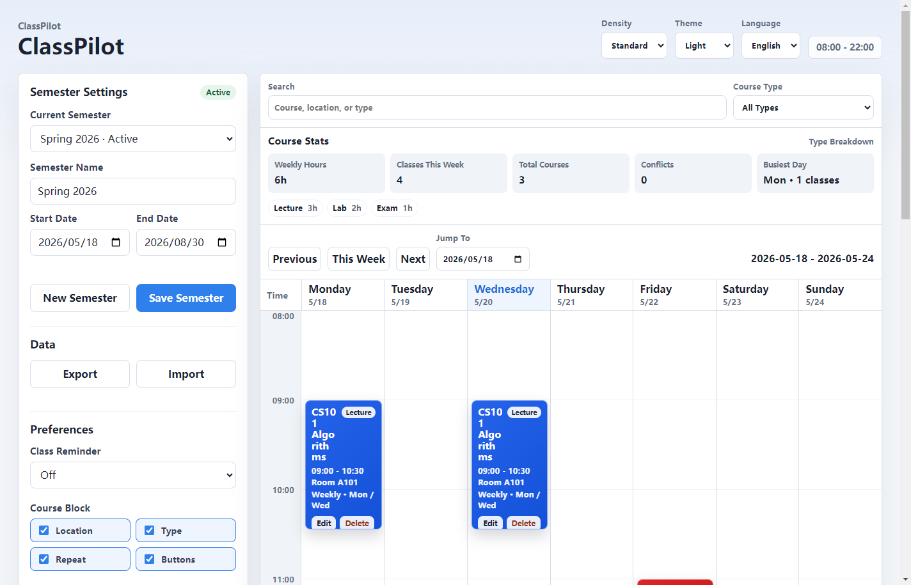

# ClassPilot

ClassPilot is an Electron desktop timetable app for courses, tutorials/labs, exams, and semester-based schedule data.



## 中文

ClassPilot 是一款桌面课程表应用，支持固定周课表，也支持每两周、每月或指定日期的非固定课程。

主要功能：

- 周视图课程表：星期一到星期日，08:00 到 22:00。
- 添加课程名称、类型、时间、地点、颜色、备注、课程链接和重复规则。
- 多学期管理，学期结束后自动归档。
- 中文/英文界面、深色模式、显示密度设置。
- 搜索筛选、课程统计、冲突提示、当前时间线。
- 桌面提醒、撤销删除、右键编辑/复制/删除。
- 本地 JSON 文件存储，支持导入/导出备份。

安装包请在 GitHub Releases 下载。

本地运行：

```bash
npm install
npm run start
```

本地打包：

```bash
npm run build
```

数据文件位置：

```text
%APPDATA%\ClassPilot\classpilot-data.json
```

## English

ClassPilot is a desktop timetable app for regular weekly classes and irregular schedules such as biweekly, monthly, or specific-date sessions.

Features:

- Weekly timetable from Monday to Sunday, 08:00 to 22:00.
- Add course name, type, time, location, color, notes, course link, and recurrence.
- Multi-semester data with automatic archive after a semester ends.
- Chinese/English UI, dark mode, and display density settings.
- Search, filters, course stats, conflict warnings, and current time line.
- Desktop reminders, undo delete, and right-click edit/duplicate/delete.
- Local JSON storage with import/export backup.

Download the installer from GitHub Releases.

Run locally:

```bash
npm install
npm run start
```

Build locally:

```bash
npm run build
```

Local data path:

```text
%APPDATA%\ClassPilot\classpilot-data.json
```

## Release

Pushing a tag such as `v1.0.0` runs the GitHub Actions release workflow, builds the Windows installer, and uploads it to the GitHub Release.

## Tech Stack

- Electron
- HTML, CSS, JavaScript
- Electron Builder
